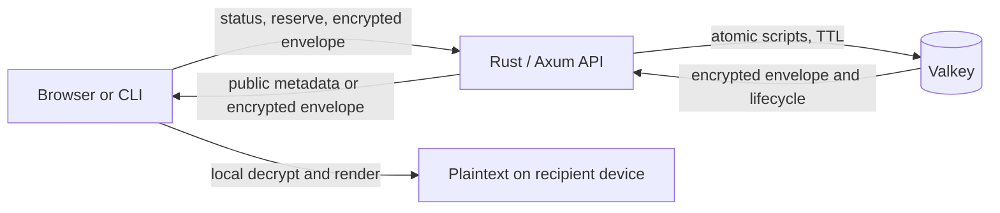

<p align="center">
  
</p>

# Nyanbin

**Encrypted notes and files with a tiny bit of magic.**

Nyanbin is a self-hostable, client-side-encrypted paste and file-sharing service. It combines a compact Rust/Axum server, an atomic Valkey lifecycle store, a Svelte web client, and a Node.js CLI behind one versioned protocol. Its original interface uses a blue-paper palette, cornflower accents, tactile keylines, and geometric cat motifs.

Nyanbin is designed so that a correctly operating server stores and returns an authenticated encrypted envelope without receiving the link secret, optional password, plaintext, filenames, or file bytes in plaintext. This is a focused security property—not a claim of anonymity, audited security, or protection from a malicious web server.

A reference instance runs at [bin.oh.rip](https://bin.oh.rip). There is no other official hosted instance or confirmed public Nyanbin domain; configure the web client or CLI to use an instance you trust.

## Features

| Capability | Nyanbin v1 |
| --- | --- |
| Content | Plain text, source text, sanitized Markdown, multiple files, or text and files together |
| Client-side encryption | One authenticated envelope containing content, format, filenames, MIME hints, sizes, and attachments |
| Link secret | 256-bit random bearer secret kept in the URL fragment |
| Optional password | A second factor; it does not replace the random link secret |
| Retention | Required absolute expiry, bounded by the instance |
| Read limits | Optional atomic read cap; one read is burn-after-reading |
| Reveal | Explicit `POST`; navigation, metadata checks, and link previews do not consume a read |
| Revocation | Independent random creator delete capability |
| Clients | Responsive web UI and interoperable `nyanbin` CLI |
| Sharing | Local copy and QR generation; no external shortener |
| Rendering | Literal plain text, source presentation, sanitized Markdown, safe local previews, and forced downloads |
| Appearance | Light, dark, and system themes; reduced-motion and keyboard-conscious UI |
| Runtime privacy | No analytics, third-party runtime assets, remote Markdown resources, or arbitrary operator HTML |

## Security model

### What Nyanbin is intended to protect

Under an honest, unmodified client and server implementation:

- note contents and encrypted metadata are confidential from the server and Valkey;
- envelope tampering and lifecycle/header substitution are detected during decryption;
- the optional password adds a second factor to the high-entropy link secret;
- expiry and read limits are applied atomically by the shared Valkey store, including across multiple app replicas;
- passive page loads, crawlers, and link scanners cannot consume a note because reveal is an explicit action;
- the server stores only a SHA-256 verifier for the creator's delete capability after creation.

### What Nyanbin does not protect

Nyanbin does **not** provide anonymity. The service operator, reverse proxy, network provider, or traffic observer may learn IP addresses, timing, request sizes, note identifiers, lifecycle policy, and access patterns. The operator also controls the JavaScript delivered by the hosted web client and could serve code that steals future secrets or plaintext. Self-hosting does not remove that browser code-distribution trust boundary.

Nyanbin also cannot protect against:

- a compromised browser, CLI host, extension, clipboard, terminal history, or recipient device;
- a recipient copying, photographing, or redistributing content before a read limit destroys it;
- disclosure of the complete share URL, its fragment, the password, or the delete token;
- weak user-chosen passwords—the link secret is deliberately still required;
- denial of service, storage eviction, operator deletion, rollback, or loss of an ephemeral Valkey instance;
- plaintext already exposed before encryption or after local decryption;
- a malicious instance serving a modified client, lying about policy, or correlating metadata;
- cryptographic implementation defects. Nyanbin has not been independently audited.

A reveal consumes a read **before** local decryption. A wrong password, damaged URL, corrupt envelope, or incompatible client can therefore spend a limited read. The web UI must present this consequence before reveal.

Treat the complete share URL and the delete token as bearer credentials. Send the password through a different channel when the second factor matters.

## Architecture and data flow



The browser and Node.js clients use the shared TypeScript API and protocol implementation in `packages/cli/src/shared`. The static Svelte application is built into the Rust image and served by Axum. Valkey is the sole v1 lifecycle store.

Creation is deliberately two-step because the server-generated note ID is authenticated as additional data:

1. The client reads `/api/status`, chooses a duration and optional read cap within the advertised limits, and reserves a note.
2. The server generates a 32-character base62 ID, an independent 32-byte delete token, and the exact absolute lifecycle. The reservation is short-lived.
3. The client generates a 32-byte link secret, builds the complete private payload, and encrypts it locally. Protocol version, note ID, and exact lifecycle are authenticated as AAD.
4. The client commits the encrypted envelope and the delete-token verifier to the reserved ID. Valkey installs the note and TTL atomically.
5. The share URL is `/note/{id}#{secret}`. URL fragments are not included in normal HTTP requests, so the server receives the ID but not the link secret.
6. A recipient may inspect public lifecycle information without consuming a read. Explicit reveal atomically consumes a read and returns the envelope; decryption then happens locally.
7. The creator may revoke the note by presenting the independent delete token. The server compares it with its stored verifier.

## Cryptography and wire format

Nyanbin v1 is a closed protocol and is not wire-compatible with Cryptgeon or PrivateBin.

- **Protocol version:** `1`
- **Content encryption:** AES-256-GCM
- **Nonce/IV:** 12 random bytes per envelope
- **Authentication tag:** 128 bits
- **Link secret:** 32 CSPRNG bytes, encoded as unpadded base64url in the URL fragment
- **Password mode:** PBKDF2-HMAC-SHA-256, 600,000 iterations, 16-byte salt; the password is an additional factor alongside the link secret
- **Authenticated data:** canonical protocol version, 32-character note ID, and exact server-issued lifecycle
- **Delete capability:** 32 random bytes, encoded as base64url; only its SHA-256 hexadecimal verifier is retained after creation
- **Private payload:** content kind and format, text, and every file's name, MIME hint, size, and base64url bytes are encrypted together

AES-GCM authenticates the ciphertext and AAD; it does not hide ciphertext length. The fixed v1 password parameters are intentionally bounded for interoperability. A future parameter change requires a new protocol version rather than ambiguous negotiation.

## Quick start with Docker Compose

Requirements: Docker with the Compose plugin and a local Nyanbin checkout. From the repository root:

```sh
docker build --tag nyanbin:latest .
docker compose up -d
```

Open `http://localhost:8000` and check dependency readiness with:

```sh
curl --fail http://localhost:8000/api/ready
```

Stop the stack with:

```sh
docker compose down
```

The production Compose file starts `app` and Valkey. It uses the local image `nyanbin:latest` by default, publishes port `8000`, and stores Valkey data only in a bounded tmpfs. Build that image with the command above, or override the image and host port:

```sh
NYANBIN_IMAGE=registry.example/nyanbin:1.0.0 \
NYANBIN_PORT=8080 \
docker compose up -d
```

Then terminate TLS at a reverse proxy and forward to the selected local port. Except for loopback development, use HTTPS: it protects the application and request metadata in transit and is required for the browser cryptography APIs in normal secure contexts.

### Default Valkey behavior

The included Compose service uses Valkey 8.1 Alpine with snapshots and AOF disabled, a `256mb` memory ceiling, `noeviction`, and `/data` on tmpfs. Change the ceiling with `VALKEY_MAXMEMORY`.

`noeviction` makes writes fail under memory pressure rather than silently discarding live notes. Monitor capacity and failed creates. Ephemeral storage means every note is lost on restart. If you enable Valkey persistence, replication, or backups, encrypted envelopes and operational metadata may survive process restarts and may remain in backups after logical expiry. Protect and retire those copies accordingly.

## Development from source

The checked-in tool versions are Node.js 24, pnpm 11.5, and Rust 1.95. The easiest setup uses [mise](https://mise.jdx.dev/) plus Docker:

```sh
mise install
pnpm install --frozen-lockfile
pnpm run dev
```

This starts development Valkey, the Rust backend, the Svelte client, and the CLI watcher. Open `http://localhost:3000`; Vite proxies `/api` to the backend on port `8000`.

Useful workspace commands:

```sh
pnpm run build       # build all workspace packages
pnpm run check       # run declared package checks
pnpm run docker:up   # build and start the E2E stack on localhost:3000
pnpm run docker:down # stop the E2E stack
```

The production container is a multi-stage Node/Rust build. Its runtime process is the `nyanbin` binary, runs as UID/GID `10001`, and serves the built frontend without requiring filesystem writes.

## Configuration

Configuration is by environment variable. Durations are seconds; `expiresAt` values returned by the API are Unix epoch milliseconds. Container deployments override `NYANBIN_REDIS_URL` to address the Compose `valkey` service.

| Variable | Default | Purpose |
| --- | ---: | --- |
| `NYANBIN_LISTEN_ADDR` | `0.0.0.0:8000` | Backend listen address |
| `NYANBIN_REDIS_URL` | `redis://127.0.0.1/` | Valkey connection URL |
| `NYANBIN_REDIS_PREFIX` | `nyanbin:` | Namespace for Valkey keys |
| `NYANBIN_FRONTEND_PATH` | `../frontend/build` | Static frontend build directory |
| `NYANBIN_MAX_ENVELOPE_BYTES` | `1048576` | Maximum decoded binary envelope size; HTTP JSON/base64 overhead is accounted for separately |
| `NYANBIN_MAX_EXPIRES_IN` | `604800` | Maximum requested lifetime (7 days) |
| `NYANBIN_DEFAULT_EXPIRES_IN` | `86400` | Default requested lifetime (24 hours) |
| `NYANBIN_MAX_READS` | `100` | Maximum read cap |
| `NYANBIN_DEFAULT_MAX_READS` | `1` | Default read cap; `1` is burn-after-reading and `0` omits the cap |
| `NYANBIN_RESERVATION_TTL_SECONDS` | `120` | Lifetime of an uncommitted reservation |
| `NYANBIN_REDIS_TIMEOUT_MS` | `2000` | Valkey operation timeout |
| `NYANBIN_RATE_LIMIT_REQUESTS` | `30` | Reserve and commit attempts allowed per client bucket and fixed window |
| `NYANBIN_RATE_LIMIT_GLOBAL_REQUESTS` | `300` | Global reserve and commit ceiling per fixed window across rotating clients |
| `NYANBIN_RATE_LIMIT_WINDOW_SECONDS` | `60` | Write rate-limit window |
| `NYANBIN_RATE_LIMIT_IPV6_PREFIX_BITS` | `64` | IPv6 prefix length grouped into one client bucket (`0`–`128`) |
| `NYANBIN_TRUSTED_PROXY_CIDRS` | empty | Comma-separated proxy CIDRs allowed to supply forwarded client addresses |
| `NYANBIN_BRANDING_NAME` | `Nyanbin` | Safe text instance name |
| `NYANBIN_BRANDING_DESCRIPTION` | empty | Safe text instance description; when empty the web client shows a localized default |
| `NYANBIN_BRANDING_LOGO_URL` | empty | Optional branding URL |
| `NYANBIN_BRANDING_IMPRINT_URL` | empty | Optional imprint URL |

Both reserve and commit are metered before JSON body decoding with per-client and global Valkey-backed ceilings. IPv6 clients are grouped by the configured prefix so rotating interface identifiers does not mint new buckets. This remains an abuse-control layer, not comprehensive denial-of-service protection. Forwarded client addresses are ignored unless their immediate proxy matches `NYANBIN_TRUSTED_PROXY_CIDRS`; malformed chains fall back to the peer address. List only proxies you operate. Branding values are exposed by `/api/status` and must never contain secrets. Nyanbin does not accept arbitrary operator HTML.

## CLI

The package and executable are both named `nyanbin` and require Node.js 22 or newer. The default server is `http://localhost:8000`; set an instance explicitly for non-local use. There is no hard-coded public service:

```sh
npm install --global nyanbin
export NYANBIN_SERVER=https://paste.example

nyanbin info
nyanbin create text 'meet at 10' --expires 2h --max-reads 3
nyanbin create text '# private' --format markdown --file diagram.png --expires 1d
nyanbin create file report.pdf photo.jpg --expires 30m --password 'second factor'
nyanbin open 'https://paste.example/note/0123456789abcdefghijklmnopqrstuv#<link-secret>'
nyanbin delete 'https://paste.example/note/0123456789abcdefghijklmnopqrstuv#<link-secret>' \
  --delete-token '<creator-delete-token>'
```

`--expires` accepts a positive integer with `s`, `m`, `h`, or `d`; a bare integer is seconds. Creation prints two separate lines:

```text
Note: <complete-share-url>
Delete token: <creator-delete-token>
```

Save the delete token separately; it is not recoverable from the share URL. `create text` accepts `plain`, `source`, or `markdown` via `--format` and repeatable `--file` attachments. `create file` creates a files-only note. The `info` and `create` commands accept `-s, --server` as an alternative to `NYANBIN_SERVER`; `open` and `delete` derive the instance origin from the note URL. Password and delete-token arguments may be visible in shell history or process listings. Use `--password-stdin` to read a password exactly through EOF (one final line ending is removed); it is mutually exclusive with `--password`. Decrypted text is terminal-safe by default; use `open --raw` only when exact output from a trusted sender is intentional.

## API overview

The API is JSON under `/api`. Errors use `{ "code": "...", "message": "..." }`. Unknown fields and malformed canonical encodings are rejected. Clients must follow reserve → encrypt → commit; a one-step create cannot authenticate the server-generated ID.

| Method and path | Purpose | Success |
| --- | --- | --- |
| `GET /api/live` | Process liveness; does not require Valkey | `200` when the process is live |
| `GET /api/ready` | Dependency readiness | `200` only when Valkey is usable |
| `GET /api/status` | Protocol, limits/defaults, content capabilities, and safe branding | Status JSON |
| `POST /api/notes/reserve` | Reserve lifecycle and generate capabilities | `201 { id, deleteToken, lifecycle }` |
| `PUT /api/notes/{id}` | Commit authenticated envelope to its reservation | `201 { id }` |
| `GET /api/notes/{id}` | Inspect lifecycle without consuming a read | `200 { protocol: 1, lifecycle }` |
| `POST /api/notes/{id}/reveal` | Atomically consume and return the envelope | `200 { protocol: 1, envelope }` |
| `DELETE /api/notes/{id}` | Delete with creator capability | `204` |

Representative request bodies follow. Reserve uses:

```json
{ "expiresIn": 3600, "maxReads": 1 }
```
Omit `maxReads` to use the server default; send `maxReads: 0` to request an expiry-only note with no read cap. A reserved or committed lifecycle never contains zero: uncapped lifecycle responses omit the field.


Commit uses:

```json
{
  "protocol": 1,
  "envelope": "<canonical-base64url-envelope>",
  "lifecycle": { "expiresAt": 1786669200000, "maxReads": 1 },
  "deleteTokenHash": "<sha256-hex>"
}
```

Delete uses:

```json
{ "deleteToken": "<canonical-base64url-token>" }
```

`POST .../reveal` has an empty body. The public info lifecycle can include `remainingReads`; it never returns the envelope. Reserve accepts a relative duration, but the server returns the exact lifecycle used for encryption and commit. The server will not let commit mutate the reserved lifecycle or verifier.

Use the shared TypeScript implementation rather than reimplementing cryptography from this overview. The wire contract includes strict canonical serialization and validation details that prose and example JSON do not fully specify.

## Deployment hardening

Before exposing an instance:

1. **Use TLS.** Terminate HTTPS at a maintained reverse proxy; redirect HTTP and configure modern transport policy.
2. **Keep Valkey private.** Do not publish it to the internet. Use network isolation, authentication/ACLs, and TLS when it crosses a host boundary.
3. **Set trusted proxies narrowly.** Only enumerate the exact CIDRs that may assert forwarded client IPs. Never trust arbitrary `X-Forwarded-For` input.
4. **Bound resources.** Set envelope, expiry, read, request-body, Valkey memory, connection, and proxy timeout limits appropriate to the host. Account for JSON/base64 transport overhead above the decoded envelope limit.
5. **Preserve atomicity.** Multiple app replicas must share the same supported Valkey deployment; do not insert a cache that replays or coalesces reveal requests.
6. **Do not cache API responses.** In particular, never cache reveal, reserve, commit, delete, or note-info responses at a CDN or reverse proxy.
7. **Retain security headers.** Do not weaken the application's CSP and related headers or inject third-party scripts, analytics, fonts, operator HTML, or remote runtime assets into cryptographic pages.
8. **Harden the container.** Keep the supplied non-root user, read-only root filesystem, dropped capabilities, `no-new-privileges`, and small writable tmpfs. Pin reviewed image versions or digests.
9. **Protect logs.** Do not log bodies, complete share URLs, fragments, passwords, delete tokens, envelopes, keys, or plaintext. Minimize and expire IP/address logs.
10. **Monitor safely.** Probe `/api/live` for process health and `/api/ready` for Valkey readiness. Alert on storage pressure, timeouts, rate limits, and failed commits without recording secrets.
11. **Plan failure behavior.** Ephemeral Valkey favors bounded retention over durability. If durability is enabled, document the privacy trade-off, encrypt backups, and test expiry and deletion behavior.
12. **Patch the whole delivery chain.** A compromised reverse proxy, image registry, static frontend, or dependency can defeat client-side encryption.

The Compose profile already runs the app as UID/GID `10001`, mounts a read-only root filesystem, drops Linux capabilities, enables `no-new-privileges`, and uses a small `/tmp` tmpfs. Treat these as a baseline, not a complete production security boundary.

## Testing

Install dependencies and Playwright browsers, build the app and image, then run the browser/CLI interoperability suite:

```sh
pnpm install --frozen-lockfile
pnpm run test:prepare
pnpm --filter nyanbin test # shared protocol/API/CLI security contracts
pnpm licenses:generate    # regenerate the locked dependency inventory
pnpm run test:local  # Chromium
pnpm test            # Chromium, Firefox, and WebKit
pnpm run check
```

The suite is intended to cover browser/CLI text and file interoperability, optional passwords, lifecycle behavior, deletion, tamper failures, concurrent atomic reveals, health, headers, and the create → reveal → decrypt path. The end-to-end server is available at `http://localhost:3000`; override it with `NYANBIN_E2E_URL` when testing another deployment.

A green test suite is not a security audit. Review protocol changes carefully and add deterministic cross-client vectors whenever cryptographic behavior changes.

## Privacy notes for operators and users

The encrypted envelope hides content and its private manifest, but the server necessarily handles the note ID, exact expiry/read policy, envelope length, reservation/delete requests, and network metadata. It generates the delete token during reservation and handles it again if deletion is requested, while retaining only the verifier after creation. Valkey holds ciphertext, lifecycle state, verifiers, temporary reservations, and rate-limit buckets.

The fragment secret and password stay local only when the delivered client behaves as intended. Browsers normally omit URL fragments from HTTP requests, but users can still leak complete URLs through copying, screenshots, clipboard managers, browser extensions, synced history, chat previews, or recipient behavior. Operators should publish an accurate log-retention and legal policy for their deployment rather than describing it as anonymous.

Nyanbin makes no third-party runtime requests by default. QR generation, rendering, fonts, icons, and assets are local. Sanitized Markdown must not fetch remote content.

## Security reporting

Do not publish an unpatched vulnerability, exploit, secret, or live note in a public issue. Use the repository host's private vulnerability-reporting channel when one is advertised. If no private channel is currently listed, contact a maintainer through the repository host and ask for a private channel **without including sensitive details in the first public message**. Include affected revision, impact, reproduction steps, and a minimal proof once a private channel is established.

There is intentionally no unconfirmed security email address in this document.

## Scope and roadmap

Nyanbin v1 deliberately excludes discussions/comments, never-expiring notes, multiple storage engines, URL shorteners, analytics, arbitrary operator HTML, external runtime assets, and Cryptgeon/PrivateBin wire compatibility. These are not hidden configuration flags.

The v1 roadmap is conservative: maintain deterministic browser/Node interoperability, strengthen validation and accessibility, keep atomic lifecycle behavior under concurrency, improve deployment observability without collecting secrets, and obtain independent security review. Multi-writer discussion would require a separate protocol and conflict analysis rather than an extension of the v1 envelope.

## Provenance and licenses

Nyanbin uses Cryptgeon as its technical foundation and is a substantial fork of Cryptgeon revision `1f180a2e53b79dce4e201e4ec2fcf5201538c4b2`, which was reviewed while planning the fork. Cryptgeon's MIT copyright notice—Copyright (c) 2021 Niccolo Borgioli—is preserved in [`LICENSE`](./LICENSE).

PrivateBin revision `88cf90534de33f950411c12cdee87d841d97947c` was studied for conceptual inspiration: encrypted metadata, explicit burn behavior, deletion capabilities, rich formats, and security-focused product language. No PrivateBin source code or artwork is included, and Nyanbin is not wire-compatible with PrivateBin.

WidgetStar's rendered interface was studied only as mood inspiration. Nyanbin does not include WidgetStar source, logo, mascot, artwork, textures, sprites, icons, or geometry, and no endorsement by WidgetStar or PrivateBin is implied.

Nyanbin's original contributions are available under the MIT License, Copyright (c) 2026 Nyanbin contributors. See [`LICENSE`](./LICENSE) for the terms, [`THIRD_PARTY_NOTICES`](./THIRD_PARTY_NOTICES) for explicit provenance, and [`DEPENDENCY_LICENSES.csv`](./DEPENDENCY_LICENSES.csv) for the generated locked dependency and bundled-asset inventory. Dependencies and bundled assets remain under their respective licenses.

## Contributing

Contributions should preserve the protocol's clean version boundary, browser/CLI interoperability, atomic lifecycle semantics, strict input validation, local-only runtime assets, and accessible UI. Do not add raw secret/plaintext logging, external analytics, a public-service default, or a second wire convention beside v1.

Before submitting a change:

```sh
mise install
pnpm install --frozen-lockfile
pnpm run build
pnpm run check
pnpm run test:local
```

Use focused commits, explain user-visible and security effects, and include tests for new observable contracts. Cryptographic or lifecycle changes must include deterministic cross-client coverage and explicit migration/version reasoning. By contributing, you agree that your contribution is provided under the repository's MIT License.
